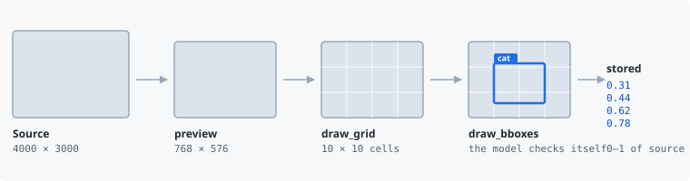

<p align="center">
  
</p>

<h1 align="center">annotools</h1>

<p align="center">
  让 agent 在 token 预算内查看并标注多模态数据。
</p>

<p align="center">
  <a href="https://github.com/hoshiori-dev/annotools/actions/workflows/ci.yml"></a>
  
  
  <a href="LICENSE"></a>
  <a href="https://hoshiori-dev.github.io/annotools/"></a>
</p>

<p align="center">
  <a href="https://hoshiori-dev.github.io/annotools/">文档</a> ·
  <a href="README.md">English</a>
</p>

<p align="center">
  
</p>

把全分辨率媒体直接喂给多模态模型既昂贵又不精确。annotools 改为给 agent 专门构造的视图——降采样预览、
裁剪放大、网格参考线，以及检测框、关键点、多边形和分割掩码的叠加，让它在提交之前先检查自己的标注。
所有坐标只有一种约定：相对于未裁剪原图归一化到 0.0–1.0。

## 两种用法

| 🔌 面向 coding agent 的 MCP 服务器 | 📦 面向 agent 开发者的 Python 库 |
|---|---|
| 为 Claude Code、Codex、OpenCode 提供 13 个工具 | 同样的预览、叠加与坐标转换，以函数提供 |
| agent 查看数据集只花很小一部分上下文 | 给你自己的执行 agent 装上眼睛，无需 MCP 客户端 |
| 预览尺寸是配置项，按模型调节成本 | `import annotools` 不会加载 `fastmcp` |
| [→ 工具参考](https://hoshiori-dev.github.io/annotools/mcp/tools/) | [→ API 参考](https://hoshiori-dev.github.io/annotools/api/) |

## 快速开始

```bash
uv add "annotools[media] @ git+https://github.com/hoshiori-dev/annotools"
```

1.0 之前：请从 git 安装。首个正式版本会发布到 PyPI；每次发布都会同时上传 TestPyPI，那是用来演练发布
管线的，不作为安装渠道。`media` 可选依赖引入 PyAV，视频与音频工具需要它；只处理图像时可以去掉。

### 作为 MCP 服务器

通过 stdio 注册 `annotools` 命令。Claude Code 使用 `.mcp.json`：

```json
{
  "mcpServers": {
    "annotools": {
      "type": "stdio",
      "command": "uv",
      "args": ["run", "annotools"],
      "env": { "ANNOTOOLS_MAX_WIDTH": "768", "ANNOTOOLS_MAX_HEIGHT": "768" }
    }
  }
}
```

按 agent 背后的模型设置预览尺寸：384 px（默认值）让 Gemini 的一张图保持在一个 258 token 的单位内，
而 Claude 与 GPT 按面积计费，768 px 读起来更从容。Codex 与 OpenCode 的写法、全部配置项以及 HTTP
传输见[注册服务器](https://hoshiori-dev.github.io/annotools/getting-started/register/)。

### 作为 Python 库

```python
from annotools import BBoxObject, draw_bboxes, encode, load_image, normalize_coordinates, preview

result = preview(load_image("photo.jpg"), max_width=768, max_height=768)
boxes = normalize_coordinates(
    [[240, 130, 470, 505]],
    result.metadata["output_width"],
    result.metadata["output_height"],
)
overlay = draw_bboxes(result, [BBoxObject(bbox=boxes[0], label="cat")])
jpeg = encode(overlay.image, "jpeg")
```

## 工具

| 工具 | 作用 |
|---|---|
| `preview_image` | 裁剪 + 降采样到尺寸上限 |
| `preview_image_grid` | 预览并叠加半透明网格以锚定位置 |
| `preview_image_bboxes` | 按归一化坐标叠加检测框，可带标签 |
| `preview_image_keypoints` | 按归一化坐标叠加关键点，可带标签 |
| `preview_image_polygons` | 叠加多边形并为顶点编号 |
| `preview_image_segmentation` | 叠加 ID 掩码，逐区域标签或图例 |
| `preview_video` | 按 N fps 抽帧 → 每帧一张预览 |
| `preview_video_grid` | 按 N fps 抽帧 → 每帧叠加网格 |
| `clip_audio` | 裁剪并重采样音频为 WAV |
| `color_from_text` | 由任意文本生成稳定颜色 |
| `rotated_bbox_to_polygon` | (cx, cy, w, h, θ) → DOTA 八数字角点 |
| `normalize_coordinates` | 模型坐标系（像素或 0–1000）→ 归一化 0–1 |
| `denormalize_coordinates` | 归一化 0–1 → 模型坐标系 |

参数、返回结构与规格说明见
[工具参考](https://hoshiori-dev.github.io/annotools/mcp/tools/)。

## 文档

- [快速上手](https://hoshiori-dev.github.io/annotools/getting-started/install/) —— 安装、可选依赖、容器、MCP 注册。
- [使用](https://hoshiori-dev.github.io/annotools/usage/mcp-server/) —— 配置项、坐标约定、库调用的基本形态。
- [API 参考](https://hoshiori-dev.github.io/annotools/api/) —— 每个公开函数，由 docstring 生成。
- [架构](https://hoshiori-dev.github.io/annotools/architecture/) —— 分层与已记录的决策。
- [`skills/`](skills/) —— 可安装进你的 agent 的标注方法论：`npx skills add hoshiori-dev/annotools`。
- [`examples/`](examples/) —— 四个完整流水线：图像描述与目标检测，各有 Claude Agent SDK 与 Codex SDK 版本。

## 开发

```bash
uv sync --all-extras
just check
just docker-build && just test-container
```

`just check` 会运行 lint、格式化、类型检查、标签体系、README 同步、公开 API docstring 检查、自动生成的参考
文档漂移检查、严格模式文档构建，以及带 95% 覆盖率门槛的测试。参见
[`CONTRIBUTING.md`](CONTRIBUTING.md)；agent 从 [`AGENTS.md`](AGENTS.md) 开始。

## 许可证

Apache-2.0
