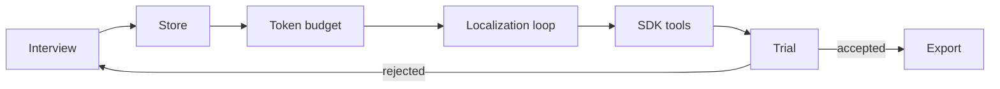

# Cookbook

An annotation project run by agents has a shape that does not change with the data: agree on what a
label means, decide where labels live, make the media cheap enough to look at, get the model to
place and check its own annotations, hand those abilities to an execution agent, prove the whole
thing on three items, then export.

Each page below is one step: what the step decides, what goes wrong when it is skipped, and where
the full procedure lives. The procedures themselves are seven agent skills, installable into any
project:

```bash
npx skills add hoshiori-dev/annotools
```

The pages summarise; the skills are the source of truth and the thing your agent actually loads.



## The steps

| Step | Decides | Skill |
|---|---|---|
| [Interview the project](interview.md) | task family, classes, output format, model, budget, quality bar — written down as `spec/task.md` | `annotation-project-interview` |
| [Choose a store](store.md) | one SQLite file per workspace, file pointers only, one row per label unit | `sqlite-annotation-store` |
| [Fit the token budget](token-budget.md) | preview size per model, prompt layout that caches, measured cost per item | `mllm-multimodal-input` |
| [Run the localization loop](localization-loop.md) | grid → propose → verify → correct → commit, with a bounded number of rounds | `localization-annotation-guide` |
| [Give the agent tools](sdk-tools.md) | `look_at_item`, `look_at_annotations`, and the three store writers, confined to the workspace | `agent-vision-tools` |
| [Trial and confirm](trial-and-confirm.md) | whether the prompt, budget, and failure handling survive contact with real items | `task-image-captioning`, `task-object-detection` |
| [Export](export.md) | what leaves the database, in which format, and what is held back | `sqlite-annotation-store` |

## Two kinds of agent

The steps involve two agents, and confusing them is the most common structural mistake.

A **coding agent** — Claude Code, Codex, OpenCode — builds the project. It talks to the annotools
[MCP server](../mcp/index.md), looks at sample data during the interview, and writes the pipeline.

An **execution agent** is what the pipeline runs, once per item, thousands of times. It never sees
the MCP server. Its developer builds a handful of tools on the [annotools library](../api/index.md)
and registers them with an agent SDK, scoped to one workspace directory. That is
[step 5](sdk-tools.md).

## Worked examples

Four complete projects implement this arc — the same two tasks on both SDKs, so the differences are
the SDK's and not the method's. Each records the numbers from a real run on 2026-08-28.

| Project | Task | SDK |
|---|---|---|
| [`image-captioning-claude`](https://github.com/hoshiori-dev/annotools/tree/main/examples/image-captioning-claude) | four caption variants per image | Claude Agent SDK |
| [`image-captioning-codex`](https://github.com/hoshiori-dev/annotools/tree/main/examples/image-captioning-codex) | four caption variants per image | Codex SDK |
| [`object-detection-claude`](https://github.com/hoshiori-dev/annotools/tree/main/examples/object-detection-claude) | cat boxes with self-correction | Claude Agent SDK |
| [`object-detection-codex`](https://github.com/hoshiori-dev/annotools/tree/main/examples/object-detection-codex) | cat boxes with self-correction | Codex SDK |

Source: [`skills/`](https://github.com/hoshiori-dev/annotools/tree/main/skills)
